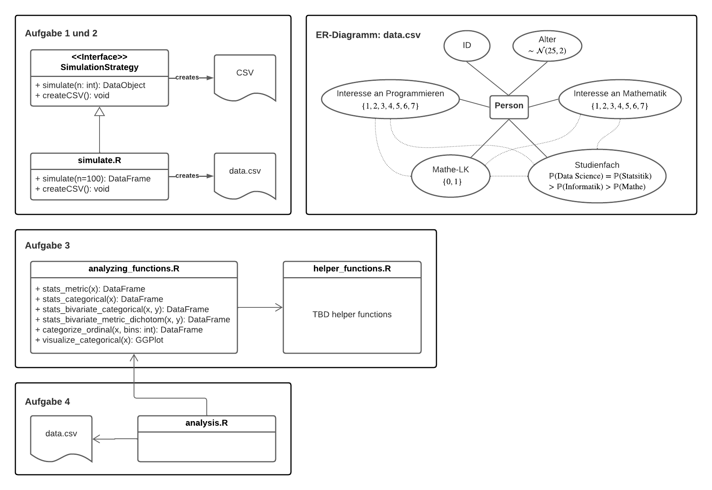

# GitHub-Projekt-Wissenschaftliches-Arbeiten

Gruppe: 10

Gruppenmitglieder:

  - Aufgabe 1: Danilo Leonel, Jonas Molsbeck 
  - Aufagbe 4: Fynn Oldenburg, Philipp Schulte-Loh, Dylan Wagner

## Anforderungen

## Inahlt 

- Aufgabe 1: [Simulation der Daten](https://github.com/fynn-oldenburg/GitHub-Projekt-Wissenschaftliches-Arbeiten/blob/main/simulation/simulate.R)
- Aufgabe 2: [csv-Datei der Daten](https://github.com/fynn-oldenburg/GitHub-Projekt-Wissenschaftliches-Arbeiten/blob/main/students-data.csv)
- Aufgabe 3: 
  - [Funktionen](https://github.com/fynn-oldenburg/GitHub-Projekt-Wissenschaftliches-Arbeiten/blob/main/functions/analyzing_functions.R)
  - [Hilfsfunktionen](https://github.com/fynn-oldenburg/GitHub-Projekt-Wissenschaftliches-Arbeiten/blob/main/functions/helper_functions.R)
- Aufgabe 4: [Anlyse](https://github.com/fynn-oldenburg/GitHub-Projekt-Wissenschaftliches-Arbeiten/blob/main/analysis/analysis.R)
- Aufgabe 5 [Diskussion](https://github.com/fynn-oldenburg/GitHub-Projekt-Wissenschaftliches-Arbeiten/issues/65)

## Verwendung des Repository

Stellen Sie bitte sicher, dass die [Hauptseite dieses Repository](https://github.com/fynn-oldenburg/GitHub-Projekt-Wissenschaftliches-Arbeiten) Ihre aktuelle **working directory** in R ist, damit die relativen Pfade funktionieren. 

## Sample-Wahrscheinlichkeiten der Daten-Simulation

Im folgenden sind die Wahrscheinlichkeiten aufgeführt, die wir für die samples bei der Simulation verwendet haben.

### Alter
Alter von Person $i := \lfloor x_i \rfloor \ ,$  wobei $x_i \sim \mathcal{N}(25, 2), \ i = 1, ..., 100$

### Studienfach
              
|Studienfach   | Wahrscheinlichkeit |
|--------------|--------------------|
|Statistik     | 35 %               |
|Datat Science | 35 %               |
|Mathematik    | 10 %               |
|Informatik    | 20 %               |

### Interesse an Mathematik

|              | 1    | 2    | 3    | 4    | 5    | 6    | 7    | 
|--------------|------|------|------|------|------|------|------|
|Statistik     | 1 %  | 5 %  | 9 %  | 15 % | 20 % | 30 % | 20 % |
|Datat Science | 5 %  | 10 % | 15 % | 25 % | 25 % | 10 % | 10 % |
|Mathematik    | 0 %  | 0 %  | 0 %  |  2 % | 18 % | 30 % | 50 % |
|Informatik    | 5 %  | 5 %  | 20 % | 20 % | 30 % | 10 % | 10 % |

### Interesse an Programmieren

|              | 1    | 2    | 3    | 4    | 5    | 6    | 7    | 
|--------------|------|------|------|------|------|------|------|
|Statistik     | 3 %  | 5 %  | 12 % | 25 % | 35 % | 15 % |  5 % |
|Datat Science | 1 %  | 2 %  |  5 % | 10 % | 30 % | 32 % | 20 % |
|Mathematik    | 5 %  | 5 %  | 20 % | 30 % | 20 % | 15 % |  5 % |
|Informatik    | 1 %  | 1 %  |  5 % | 13 % | 20 % | 30 % | 30 % |

### Mathe-LK

Sample-Wahrscheinlichkeiten für _"ja"_

|              | Basis-W'keit | Mathe-Interesse > 4 | Prog.-Interesse > 4 | max gesamt |
|--------------|--------------|---------------------|---------------------|------------|
|Statistik     |55 %          |+ 10 %               |+ 5 %                | 75 %       |
|Datat Science |50 %          |+ 10 %               |+ 5 %                | 65 %       |
|Mathematik    |70 %          |+ 10 %               |+ 5 %                | 85 %       |
|Informatik    |50 %          |+ 10 %               |+ 5 %                | 65 %       |

Entsprechend sind die Sample-Wahrscheinlichkeiten für _"nein"_ die Gegenwahrscheinlichkeiten.
